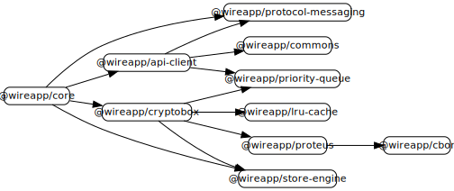

# Wire

This repository is part of the source code of Wire. You can find more information at [wire.com](https://wire.com) or by contacting opensource@wire.com.

You can find the published source code at [github.com/wireapp](https://github.com/wireapp).

For licensing information, see the attached LICENSE file and the list of third-party licenses at [wire.com/legal/licenses/](https://wire.com/legal/licenses/).

# Wire for Web: Core



## Motivation

This monorepo provides core packages which are required to send and receive encrypted messages on Wire. All packages are fully written in TypeScript.

## Development

### Preface

Every package comes with two TypeScript compiler configurations (`tsconfig.json` & `tsconfig.build.json`). The "build" config should **only** be used, when building a package for publication on npm. All other local development should never make use of compiled JavaScript code and always stick to the standard "tsconfig.json".

Thanks to the "paths" configuration in the main [tsconfig.json](./tsconfig.json), it is possible to make changes in a sub-package (e.g. "cbor") which take immediate (without prior compilation) effect on dependent packages (e.g. "proteus"). This only works, when there is no compiled (JS) code in the sub-package. 

### Getting started

```bash
# Install dependencies
yarn install

# Link packages
yarn boot

# Test packages
yarn test:all
```

### Releasing packages

#### Release new packages

Start with version "0.0.0" in `package.json` when creating a completely new package.

#### Release all packages

Publish all packages that have changed:

```
yarn release
```
